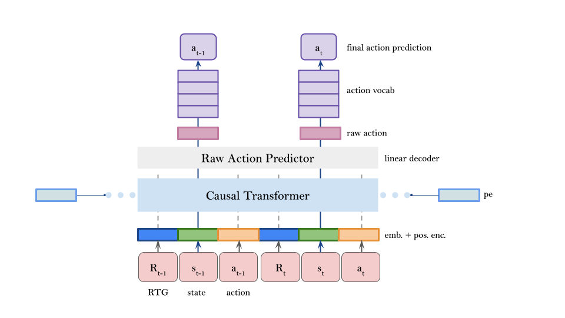

# Developing personalized AI Solutions through Reinforcement Learning

<!-- Md Siyam Sajeeb Khan (EN-52)\, Dogukan Sonmez (EN-52)\ -->


## Overview

Codebase for [Master Thesis: Developing personalized AI Solutions through Reinforcement Learning ](https://atc.bmwgroup.net/confluence/x/kVKz8).
Contains scripts to reproduce experiments.



## Instructions

### Setting up the environment:
Install miniconda or conda following these instructions: <br>
[Miniconda installation](https://docs.conda.io/projects/miniconda/en/latest/) <br>
[Anaconda installation](https://docs.anaconda.com/free/anaconda/install/index.html)

Install the dependencies and activate the virtual environment:
```
conda env create -f dt_climate.yml
conda activate decision-transformer-climate
```

### Running the experiments:<br>
There are four options to run the experiments <br>
a) With previous temperature as a feature and with personalized embeddings <br>
b) With previous temperature as a feature and without personalized embeddings <br>
c) Without previous temperature as a feature and with personalized embeddings <br>
d) Without previous temperature as a feature and without personalized embeddings <br>

You can pass these as command line arguments. For instance for option a)
```
cd smart-climate
python experiment.py --use_personalized_embeddings yes --use_prev_temp_as_feature yes
```
### Notebooks:
1. [EDA-smart-climate-data-clean.ipynb](https://atc-github.azure.cloud.bmw/ice/mlp-master-thesis-personalization/blob/main/Notebooks/EDA-smart-climate-data-clean.ipynb) - for exploratory data analysis of the climate data
2. [smart_climate_data_prep_clean.ipynb](https://atc-github.azure.cloud.bmw/ice/mlp-master-thesis-personalization/blob/main/Notebooks/smart_climate_data_prep_clean.ipynb) - for contextual and personalized feature creation. 
